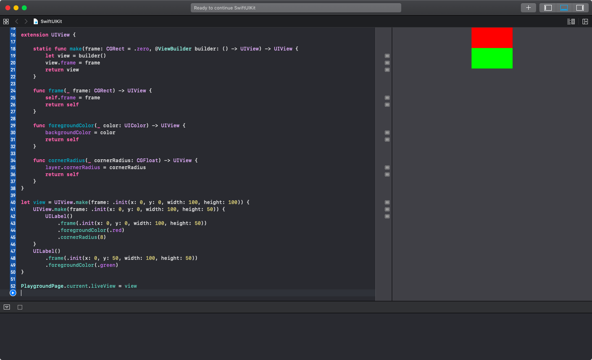

# SwiftUIKit
Make UIKit components in SwiftUI style

  

## Author

Artem Novichkov, novichkoff93@gmail.com

## License

SwiftUIKit is available under the MIT license. See the LICENSE file for more info.